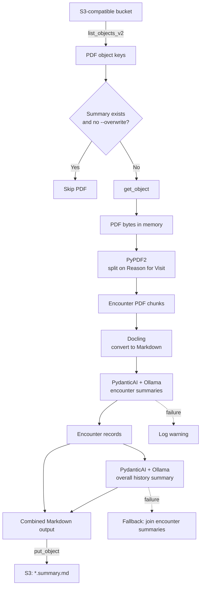

# `s3_ai_pipeline.py`

## High-level summary

`s3_ai_pipeline.py` scans an S3-compatible object store for PDF files, processes each PDF into encounter-level medical summaries, and writes a combined Markdown summary back to the same bucket. AI calls use PydanticAI with an Ollama-hosted model.

For a source object such as `records/case.pdf`, the pipeline produces `records/case.summary.md`, containing an overall patient summary followed by summaries for each encounter.

## Components and execution steps

### 1. Configuration and startup

The module reads the bucket, S3-compatible endpoint, access keys, Ollama model
and URL, and optional Discord settings from environment variables. The
`LOGFIRE_TOKEN` environment variable is consumed by Logfire. Constructing
`S3AIPipeline` creates a boto3 S3 client, initializes Docling, loads
`resources/summary-template.md`, configures the PydanticAI/Ollama agent,
initializes counters, and configures Logfire-backed logging.

### 2. Command-line arguments

`parse_args()` accepts:

| Option | Default | Purpose |
| --- | --- | --- |
| `--workers` | `4` | Configured worker count; validated to be at least 1. |
| `--overwrite` | off | Reprocess PDFs whose `.summary.md` already exists. |
| `--log-level` | `INFO` | Selects `DEBUG`, `INFO`, `WARNING`, or `ERROR`. |

Although `--workers` is accepted and stored, `run()` currently processes files sequentially.

### 3. `list_pdf_keys()`: find source PDFs

- Uses the S3 `list_objects_v2` paginator to scan the entire bucket.
- Keeps object keys ending in `.pdf`, case-insensitively.
- Returns the matching keys and logs the total.

### 4. `process_single_pdf()`: skip or download

- Derives the output key by replacing the source extension with `.summary.md`.
- Without `--overwrite`, checks the output with `head_object()` and skips it if present.
- Otherwise downloads the PDF with `get_object()` and reads its body into memory.

### 5. `_split_pdf_into_encounters()`: divide the PDF

- Reads the bytes with `PyPDF2.PdfReader`.
- Treats each page containing `Reason for Visit` (after the first page) as the start of a new encounter.
- Writes each page range to an in-memory PDF with `PdfWriter`.
- Returns encounter page ranges and PDF bytes.

### 6. `_convert_encounter_to_markdown()`: extract text

Each encounter is wrapped in a Docling `DocumentStream`, converted with `DocumentConverter`, and returned as Markdown.

### 7. `_summarize_encounter()`: summarize each encounter

The method combines the medical-record template with encounter Markdown and sends it to the PydanticAI/Ollama agent. The prompt asks the model to preserve the template structure and provide no supplemental commentary. Successful string responses receive their source page range.

Each successful result becomes an `Encounter` containing its number, page range, extracted Markdown, and summary.

### 8. `_summarize_history()`: create the overall summary

The method joins the encounter summaries and asks the agent for a historical summary. If this call fails, `process_single_pdf()` falls back to joining the encounter summaries directly.

### 9. Build and upload the output

`process_single_pdf()` formats an `Outcome` as:

```text
# Patient Summary

<overall summary>

## Encounter: 1

<encounter summary>
```

It uploads the result with `put_object()` as `text/markdown`.

### 10. `run()` and completion reporting

- Lists PDFs and exits when none are found.
- Deliberately skips keys containing `172_Johnson`.
- Processes each remaining key sequentially.
- Tracks total, processed, skipped, and failed counts.
- Logs elapsed time and final counts.
- Sends a Discord direct message when at least one file fails.

`main()` validates arguments, constructs the pipeline, handles keyboard interrupts, and returns a nonzero exit code for invalid arguments or fatal errors.

## Data flow



## Running

From the project root:

```bash
just s3-pipeline
just s3-pipeline --overwrite --log-level DEBUG
```

The `justfile` has `dotenv-load` enabled, so these commands load `.env` before
starting the script. The S3-compatible service and local Ollama server must be
reachable, and the configured model must be available.

## Environment variables

Required variables are `S3_BUCKET`, `S3_ACCESS_KEY`, `S3_SECRET_KEY`,
`S3_ENDPOINT`, `OLLAMA_MODEL`, `OLLAMA_BASE_URL`, and `LOGFIRE_TOKEN`.
Optional variables are `TEMPLATE_PATH`, `DISCORD_TOKEN`, and
`DISCORD_USER_ID`.

Keep `.env` out of version control and rotate credentials that were previously
exposed in the source.
